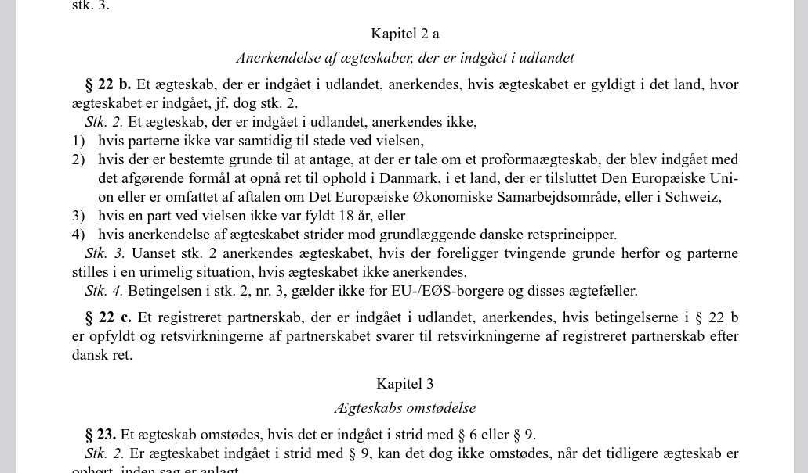
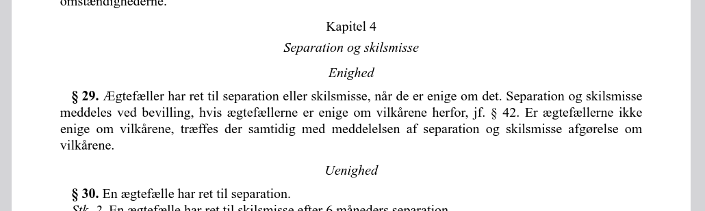
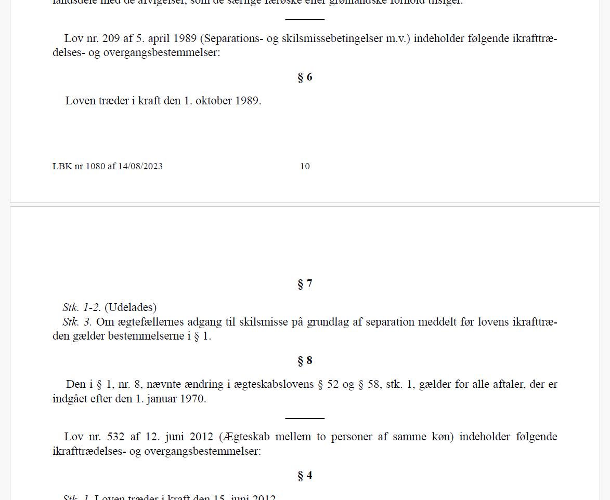
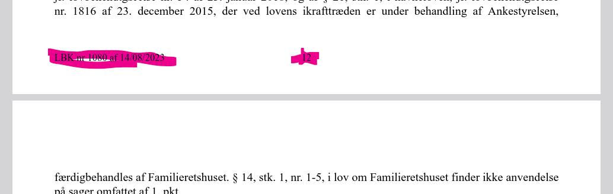
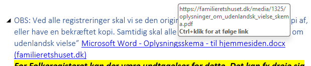
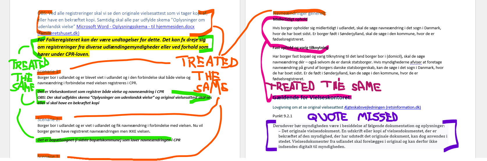
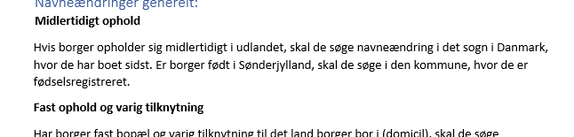

# Findings from the "vielses" case

In general be aware that *Tika* parses documents to plain text with no formatting
except newlines, whereas *Docling* parses the text to markdown output.

It does not seem possible to have *Tika* output markdown formatted text, except 
if we write a custom parser. 
[*Tika* only outputs to plain text or xHTML](https://tika.apache.org/3.2.0/examples.html#Picking_different_output_formats).   

It seems to be [hardcoded into OWUI](
https://github.com/open-webui/open-webui/blob/b5f4c85bb196c16a775802907aedd87366f58b0f/backend/open_webui/retrieval/loaders/main.py#L114C1-L114C32
) to use *Tika*s text output. 
This can of course be changed in the OWUI source, but I don't expect xHTML to be
a good markup language for LLMs. Instead, it would require that the xHTML is then
parsed as markdown using e.g. pandoc, which would introduce another sted in the 
pipeline.

Note, that also *Docling* can be configured a lot more than the chosen settings
in OWUI.

### TODOs

- TODO: Set up a direct tika pipeline, where xHTML is outputted and converted to 
        markdown.

### Table of content

- [Headings](#Headings)
- [Listings](#Listings)
- [Footers](#Footers-incl-page-numbering)
- [Links](#Links)
- [General markup](#general-markup)

## Headings

Notice: Since *Tika* does not indicate any markup, headings are not indicated in
*Tika*s transcript of the tested files.

Example of a title:

![Example of title and heading, that Docling interprets as same level headings]screendumps/title_recognition_ex-Bekendtgoerelse_af_lov_om_aegteskabs_indgaaelse_og_oploesning.png "Document title and headings from a pdf")

*Docling* interprets the title and heading/chapter as headings on same level:

> ```markdown
> ## Bekendtgørelse af lov om ægteskabs indgåelse og opløsning
> 
> Herved  bekendtgøres  lov  om  ægteskabs  indgåelse  og  opløsning,  jf.  lovbekendtgørelse  nr.  771  af  7. august 2019, med de ændringer, der følger af § 2 i lov nr. 962 af 26. juni 2020 og § 2 i lov nr. 969 af 26. juni 2020.
> 
> ## Kapitel 1
> 
> Lovens anvendelsesområde samt ægteskabsbetingelser
> 
> - § 1. Loven finder anvendelse på ægteskab mellem to personer af forskelligt køn og mellem to personer af samme køn.> 
> ```

Examples of headings in a pdf:

Example 1:



Example 2:



For the first example *Docling* interprets the layout as

> ```markdown
> ## Kapitel 2 a
> 
> Anerkendelse af ægteskaber, der er indgået i udlandet
> 
> - § 22 b. Et ægteskab, der er indgået i udlandet, anerkendes, hvis ægteskabet er gyldigt i det land, hvor ægteskabet er indgået, jf. dog stk. 2.
> - Stk. 2. Et ægteskab, der er indgået i udlandet, anerkendes ikke,
> - 1) hvis parterne ikke var samtidig til stede ved vielsen,
> - 2) hvis der er bestemte grunde til at antage, at der er tale om et proformaægteskab, der blev indgået med det afgørende formål at opnå ret til ophold i Danmark, i et land, der er tilsluttet Den Europæiske Union eller er omfattet af aftalen om Det Europæiske Økonomiske Samarbejdsområde, eller i Schweiz,
> - 3) hvis en part ved vielsen ikke var fyldt 18 år, eller
> - 4) hvis anerkendelse af ægteskabet strider mod grundlæggende danske retsprincipper.
> - Stk.  3. Uanset  stk.  2  anerkendes  ægteskabet,  hvis  der  foreligger  tvingende  grunde  herfor  og  parterne stilles i en urimelig situation, hvis ægteskabet ikke anerkendes.
> - Stk. 4. Betingelsen i stk. 2, nr. 3, gælder ikke for EU-/EØS-borgere og disses ægtefæller.
> - §  22  c. Et  registreret  partnerskab,  der  er  indgået  i  udlandet,  anerkendes,  hvis  betingelserne  i  §  22  b er opfyldt og retsvirkningerne af partnerskabet svarer til retsvirkningerne af registreret partnerskab efter dansk ret.
> 
> ## Kapitel 3
> 
> ## Ægteskabs omstødelse
> 
> - § 23. Et ægteskab omstødes, hvis det er indgået i strid med § 6 eller § 9.
> ```

Here it is especially interesting that *Docling* does not seem consistent in how
centered italic text is interpreted. After `Kapitel 2 a` the text 
`Anerkendelse af ægteskaber, der er indgået i udlandet` is considered plain text, 
as is the common way that *Docling* interprets this layout throughout that 
document, except for the case of `Ægteskabs omstødelse` after `Kapitel 3`, which
is considered another level-2 heading (as eg. `Kapitel 2 a` and `Kapitel 3`).

As the [document](https://www.retsinformation.dk/eli/lta/2019/771) originates 
from [retsinfo.dk](www.retsinformation.dk) it is possible to get an authoritative
interpretation of the layout thought the [`xml`-interface](
https://www.retsinformation.dk/eli/lta/2019/771/XML).
From that is is clear that `Anerkendelse af ægteskaber, der er indgået i udlandet`
and `Ægteskabs omstødelse` are the names of the respective chapters. Thus, the
more correct markdown interpretation would be

```markdown
## Kapitel 2 a: Anerkendelse af ægteskaber, der er indgået i udlandet

- § 22 b. Et ægteskab, der er indgået i udlandet, anerkendes, hvis ægteskabet er gyldigt i det land, hvor ægteskabet er indgået, jf. dog stk. 2.
- Stk. 2. Et ægteskab, der er indgået i udlandet, anerkendes ikke,
- 1) hvis parterne ikke var samtidig til stede ved vielsen,
- 2) hvis der er bestemte grunde til at antage, at der er tale om et proformaægteskab, der blev indgået med det afgørende formål at opnå ret til ophold i Danmark, i et land, der er tilsluttet Den Europæiske Union eller er omfattet af aftalen om Det Europæiske Økonomiske Samarbejdsområde, eller i Schweiz,
- 3) hvis en part ved vielsen ikke var fyldt 18 år, eller
- 4) hvis anerkendelse af ægteskabet strider mod grundlæggende danske retsprincipper.
- Stk.  3. Uanset  stk.  2  anerkendes  ægteskabet,  hvis  der  foreligger  tvingende  grunde  herfor  og  parterne stilles i en urimelig situation, hvis ægteskabet ikke anerkendes.
- Stk. 4. Betingelsen i stk. 2, nr. 3, gælder ikke for EU-/EØS-borgere og disses ægtefæller.
- §  22  c. Et  registreret  partnerskab,  der  er  indgået  i  udlandet,  anerkendes,  hvis  betingelserne  i  §  22  b er opfyldt og retsvirkningerne af partnerskabet svarer til retsvirkningerne af registreret partnerskab efter dansk ret.

## Kapitel 3: Ægteskabs omstødelse

- § 23. Et ægteskab omstødes, hvis det er indgået i strid med § 6 eller § 9.
```

In case of example 2 Docling interprets the pdf as:

> ```markdown
> ## Kapitel 4
> 
> Separation og skilsmisse
> 
> ## Enighed
> 
> - § 29. Ægtefæller har ret til separation eller skilsmisse, når de er enige om det. Separation og skilsmisse meddeles ved bevilling, hvis ægtefællerne er enige om vilkårene herfor, jf. § 42. Er ægtefællerne ikke enige  om  vilkårene,  træffes  der  samtidig  med  meddelelsen  af  separation  og  skilsmisse  afgørelse  om vilkårene.
> 
> ## Uenighed
> 
> - § 30. En ægtefælle har ret til separation.
> ```

it is interesting that `Separation og skilsmisse` which seems to be set with same
types as `Enighed` and `Uenighed` is interpreted differently (but the same way as 
it is interpreted together with `Kapitel 2 a` as shown above and for the other 
chapters, except the special case of `Kapitel 3` as noted above). 
Also, from [the authorative xml versdion of the document](https://www.retsinformation.dk/eli/lta/2019/771/XML) 
it is clear that `Enighed` and `Uenighed` are to be considered as subheadings
under `Kapitel 4` (so called paragraph-groups), but *Docling* interprets them as
being both at level 2.

A more serious failure in recognising the headers and other section separators
are seen from this example



This *Docling* interprets as:
> ```markdown
> 
> Lov nr. 209 af 5. april 1989 (Separations- og skilsmissebetingelser m.v.) indeholder følgende ikrafttrædelses- og overgangsbestemmelser:
> 
> Loven træder i kraft den 1. oktober 1989.
> 
> Stk. 1-2. (Udelades)
> 
> - Stk. 3. Om ægtefællernes adgang til skilsmisse på grundlag af separation meddelt før lovens ikrafttræden gælder bestemmelserne i § 1.
> 
> ## § 8
> 
> Den i § 1, nr. 8, nævnte ændring i ægteskabslovens § 52 og § 58, stk. 1, gælder for alle aftaler, der er indgået efter den 1. januar 1970.
> 
> Lov  nr.  532  af  12.  juni  2012  (Ægteskab  mellem  to  personer  af  samme  køn)  indeholder  følgende ikrafttrædelses- og overgangsbestemmelser:
> 
> ## § 4
> 
> ```

*Docling* completely misses the headings `§ 6` and `§ 7`.
Furthermore, the horizontal ruler that divides the sections on the different laws
are also missed. 

In general the last part of the law text seem to be difficult for *Docling* to 
interpret, and a number of mistakes in misinterpretations of headings can be seen
which obsures the readbility of the output compared to *Tika*s plain text output.


*Tika* outputs

> ```text
> 
> Lov nr. 209 af 5. april 1989 (Separations- og skilsmissebetingelser m.v.) indeholder følgende ikrafttræ-
> delses- og overgangsbestemmelser:
> 
> § 6
> 
>  Loven træder i kraft den 1. oktober 1989.
> 
> LBK nr 1080 af 14/08/2023 10
> 
> 
> 
> § 7
> 
> Stk. 1-2. (Udelades)
> Stk. 3. Om ægtefællernes adgang til skilsmisse på grundlag af separation meddelt før lovens ikrafttræ-
> 
> den gælder bestemmelserne i § 1.
> 
> § 8
> 
>  Den i § 1, nr. 8, nævnte ændring i ægteskabslovens § 52 og § 58, stk. 1, gælder for alle aftaler, der er 
> indgået efter den 1. januar 1970.
> 
> Lov nr. 532 af 12. juni 2012 (Ægteskab mellem to personer af samme køn) indeholder følgende 
> ikrafttrædelses- og overgangsbestemmelser:
> 
> § 4
> 
> ```

Thus, *Tika* also misses the horizontal ruler, but very important manages to get
the all the text (including also the [footer](#footers-incl-page-numbering)).

### Conclusion/Preference

- To have some structure on the text *Docling* does an okay job of interpreting 
  headings, but small inconsistencies can be observed and it does not seem to do
  a good job at distinguishing titles, headings and subheadings. This seems to be
  a [known limitation](https://github.com/docling-project/docling/discussions/386)
  for pdfs, but should be distinguised for eg. docx. 
- *Docling* misses some headings, which is a quite serious flaw

## Listings

Notice: Since *Tika* does not indicate any markup, lists are not indicated in
*Tika*s transcript of the tested files. 
Still, since the lists are "named"/"numbered" these named/numbers are transcribed
in the text output.

Considering the example also used for the [heading-section](#headings) again:


which *Docling* interprets as

```markdown
> ## Kapitel 2 a
> 
> Anerkendelse af ægteskaber, der er indgået i udlandet
> 
> - § 22 b. Et ægteskab, der er indgået i udlandet, anerkendes, hvis ægteskabet er gyldigt i det land, hvor ægteskabet er indgået, jf. dog stk. 2.
> - Stk. 2. Et ægteskab, der er indgået i udlandet, anerkendes ikke,
> - 1) hvis parterne ikke var samtidig til stede ved vielsen,
> - 2) hvis der er bestemte grunde til at antage, at der er tale om et proformaægteskab, der blev indgået med det afgørende formål at opnå ret til ophold i Danmark, i et land, der er tilsluttet Den Europæiske Union eller er omfattet af aftalen om Det Europæiske Økonomiske Samarbejdsområde, eller i Schweiz,
> - 3) hvis en part ved vielsen ikke var fyldt 18 år, eller
> - 4) hvis anerkendelse af ægteskabet strider mod grundlæggende danske retsprincipper.
> - Stk.  3. Uanset  stk.  2  anerkendes  ægteskabet,  hvis  der  foreligger  tvingende  grunde  herfor  og  parterne stilles i en urimelig situation, hvis ægteskabet ikke anerkendes.
> - Stk. 4. Betingelsen i stk. 2, nr. 3, gælder ikke for EU-/EØS-borgere og disses ægtefæller.
> - §  22  c. Et  registreret  partnerskab,  der  er  indgået  i  udlandet,  anerkendes,  hvis  betingelserne  i  §  22  b er opfyldt og retsvirkningerne af partnerskabet svarer til retsvirkningerne af registreret partnerskab efter dansk ret.
```

where each line becomes an unnumbered list. This should rightly have been interpreted as

```markdown
## Kapitel 2 a: Anerkendelse af ægteskaber, der er indgået i udlandet

- § 22 b. Et ægteskab, der er indgået i udlandet, anerkendes, hvis ægteskabet er gyldigt i det land, hvor ægteskabet er indgået, jf. dog stk. 2.
  - Stk. 2. Et ægteskab, der er indgået i udlandet, anerkendes ikke,
    1) hvis parterne ikke var samtidig til stede ved vielsen,
    2) hvis der er bestemte grunde til at antage, at der er tale om et proformaægteskab, der blev indgået med det afgørende formål at opnå ret til ophold i Danmark, i et land, der er tilsluttet Den Europæiske Union eller er omfattet af aftalen om Det Europæiske Økonomiske Samarbejdsområde, eller i Schweiz,
    3) hvis en part ved vielsen ikke var fyldt 18 år, eller
    4) hvis anerkendelse af ægteskabet strider mod grundlæggende danske retsprincipper.
  - Stk.  3. Uanset  stk.  2  anerkendes  ægteskabet,  hvis  der  foreligger  tvingende  grunde  herfor  og  parterne stilles i en urimelig situation, hvis ægteskabet ikke anerkendes.
  - Stk. 4. Betingelsen i stk. 2, nr. 3, gælder ikke for EU-/EØS-borgere og disses ægtefæller.
- §  22  c. Et  registreret  partnerskab,  der  er  indgået  i  udlandet,  anerkendes,  hvis  betingelserne  i  §  22  b er opfyldt og retsvirkningerne af partnerskabet svarer til retsvirkningerne af registreret partnerskab efter dansk ret.
```
or alternatively with the points as
```markdown
## Kapitel 2 a: Anerkendelse af ægteskaber, der er indgået i udlandet

- § 22 b. Et ægteskab, der er indgået i udlandet, anerkendes, hvis ægteskabet er gyldigt i det land, hvor ægteskabet er indgået, jf. dog stk. 2.
  - Stk. 2. Et ægteskab, der er indgået i udlandet, anerkendes ikke,
    - 1\) hvis parterne ikke var samtidig til stede ved vielsen,
    - 2\) hvis der er bestemte grunde til at antage, at der er tale om et proformaægteskab, der blev indgået med det afgørende formål at opnå ret til ophold i Danmark, i et land, der er tilsluttet Den Europæiske Union eller er omfattet af aftalen om Det Europæiske Økonomiske Samarbejdsområde, eller i Schweiz,
    - 3\) hvis en part ved vielsen ikke var fyldt 18 år, eller
    - 4\) hvis anerkendelse af ægteskabet strider mod grundlæggende danske retsprincipper.
  - Stk.  3. Uanset  stk.  2  anerkendes  ægteskabet,  hvis  der  foreligger  tvingende  grunde  herfor  og  parterne stilles i en urimelig situation, hvis ægteskabet ikke anerkendes.
  - Stk. 4. Betingelsen i stk. 2, nr. 3, gælder ikke for EU-/EØS-borgere og disses ægtefæller.
- §  22  c. Et  registreret  partnerskab,  der  er  indgået  i  udlandet,  anerkendes,  hvis  betingelserne  i  §  22  b er opfyldt og retsvirkningerne af partnerskabet svarer til retsvirkningerne af registreret partnerskab efter dansk ret.
```
But whether or not this actually makes a difference for an LLM to interpret the 
text probably depends on its training and not what makes the law text render most
correctly. It does never the less make a difference it chunks are splitted on a
rule-basis, because starting all lines with a `-` as *Docling* does would 
indicate that the list elements are all on equal footing and they are not.
The sublists should be included with its parent item and maybe grandparents 
should even be repeated for different lines of decendents.

For comparison *Tika* writes the section as:
> ```text
> Kapitel 2 a
> Anerkendelse af ægteskaber, der er indgået i udlandet
> 
> § 22 b. Et ægteskab, der er indgået i udlandet, anerkendes, hvis ægteskabet er gyldigt i det land, hvor 
> ægteskabet er indgået, jf. dog stk. 2.
> 
> Stk. 2. Et ægteskab, der er indgået i udlandet, anerkendes ikke,
> 1) hvis parterne ikke var samtidig til stede ved vielsen,
> 2) hvis der er bestemte grunde til at antage, at der er tale om et proformaægteskab, der blev indgået med 
> 
> det afgørende formål at opnå ret til ophold i Danmark, i et land, der er tilsluttet Den Europæiske Uni-
> on eller er omfattet af aftalen om Det Europæiske Økonomiske Samarbejdsområde, eller i Schweiz,
> 
> 3) hvis en part ved vielsen ikke var fyldt 18 år, eller
> 4) hvis anerkendelse af ægteskabet strider mod grundlæggende danske retsprincipper.
> 
> Stk. 3. Uanset stk. 2 anerkendes ægteskabet, hvis der foreligger tvingende grunde herfor og parterne 
> stilles i en urimelig situation, hvis ægteskabet ikke anerkendes.
> 
> Stk. 4. Betingelsen i stk. 2, nr. 3, gælder ikke for EU-/EØS-borgere og disses ægtefæller.
> 
> § 22 c. Et registreret partnerskab, der er indgået i udlandet, anerkendes, hvis betingelserne i § 22 b 
> er opfyldt og retsvirkningerne af partnerskabet svarer til retsvirkningerne af registreret partnerskab efter 
> dansk ret.
> ```

where some spurrious newlines might distrub the interpretation a little bit 
depending on the actual LLM used.

*Docling* generally seems to be consistent on recognising lists, but also makes
mistakes as seen eg. here:


that *Docling* transcribes as:
> ```markdown
> - §  10. Er  et  tidligere  ægteskab  eller  registreret  partnerskab  opløst  ved  død,  må  den  længstlevende ægtefælle  eller  registrerede  partner  ikke  indgå  ægteskab,  før  dødsbobehandling  ved  bobestyrer  eller offentligt skifte er påbegyndt, eller privat skifte er afsluttet. Dette gælder dog ikke, hvis
> - 1) der ikke var noget formuefællesskab mellem ægtefællerne eller de registrerede partnere,
> - 2) ægtefællerne eller de registrerede partnere var separerede på tidspunktet for dødsfaldet,
> - 3) samtlige arvinger efter afdøde giver samtykke hertil og den længstlevende ægtefælle ikke har overtaget ægtefællernes fælleseje til uskiftet bo efter § 17 i arveloven, eller
> - 4) der ikke skal foretages dødsbobehandling her i landet.
> 
> Stk. 2. Den myndighed, som efter § 13 skal prøve ægteskabsbetingelserne, kan tillade, at stk. 1 fraviges.
> 
> - § 11. (Ophævet)
> ```

where `Stk. 2. Den myndighed, som ...` should also be listed as a point to stay consistent.

### Conclusion/Preference

- As any list item is threated on equal footing there isn't much difference
  between having the list indicated in markdown and not having any markup on
  lists (as *Tika* does)

## Footers (incl page numbering)

For a footer in a pdf:



*Docling*: Ignores the information in the footer, both page numbering and the
text.

*Tika*: Writes the text and the page number on the same line separated by a space
interrupting the text flow for the main content.

> ```text
> jf. lovbekendtgørelse nr. 54 af 23. januar 2018, og af § 21, stk. 1, i navneloven, jf. lovbekendtgørelse 
> nr. 1816 af 23. december 2015, der ved lovens ikrafttræden er under behandling af Ankestyrelsen, 
> 
> LBK nr 1080 af 14/08/2023 12
>
>
>
> færdigbehandles af Familieretshuset. § 14, stk. 1, nr. 1-5, i lov om Familieretshuset finder ikke anvendelse 
> på sager omfattet af 1. pkt. 
> ```

### Conclusion/Preference

**Docling**: In this case, also when the footer content is just placed between
sections, the Docling behaviour is preferred to not have spurrious text appear
within chunks provided to an LLM.

### Note

- If the footer had contained eg. footnotes *Docling* approach is not desirable.
  This, though, have not been tested.
- To conclude anything finale on the handling of footers additional focused tests
  should be performed.

## Links

*Docling* detects some links. *Tika*s plain text does not.

For two examples from the same word document:




That *Docling* interprets as

> ```markdown
> ### OBS: Ved alle registreringer skal vi se den originale vielsesattest som vi tager kopi af, eller have en bekræftet kopi. Samtidig skal alle par udfylde skema ”Oplysninger om udenlandsk vielse” Microsoft Word - Oplysningsskema - til hjemmesiden.docx (familieretshuset.dk)
> ```

and

> ```markdown
> Lovgivning om at se original vielsesattest [Ægteskabsvejledningen (retsinformation.dk)](https:/www.retsinformation.dk/eli/retsinfo/2022/10410)
> ```

respectively. The reason the link is not detected in the first case, might be
because it is only identified as a heading.

### Conclusion/preference

- It seems very important to be able to provide links to a user through the LLM,
  in order to do so, the link is needed in the raw material, so here *Docling*
  is prefere over *Tika*

## General markup

For bold and italic markup *Docling* seems to do quite well (as least for docx). 
*Tika* only outputs plain text. 

A general example can be seen here



Where *Tika* just outputs plain text, *Docling* tries to make sense of the 
markup. The headlines marked with orange are all marked in word as header level 3
and this *Docling* trusts, eventhough it seems that for the `OBS: Ved ...` 
text at the begining "header 3" is just used as a way to put emphasis on the text.

The bold italic text marked with green are also just transcribed as such although 
the author seems to think the text `For Folke...` is more important as this is set
with larger types and marked with yellow highlightning.

Finally this also goes for the bold text marked with pink, though one might think 
that the text `Gældende ...` would more rightly be set as maybe a header level 2.

Finally since the quote from the law tekst is just indented and highligted in grey
it is not recognised as a quote (it probably would have been if the author had
used the qoute markup in Word).

If simpler is preferred *Tika* is the way to go, for an example like



where the procedure is conditioned on something, which is marked with bold, then
maybe an LLM would be more likely to put emphasis on the conditions, when markup
is used. That'll probably depend on the LLMs training, but from prompt 
engineering it is my *feeling*, that it is established, that text markup makes a
difference to LLMs in general.

In this case *Docling* produces
> ```markdown
> ### Navneændringer generelt:
> 
> **Midlertidigt ophold**
> 
> Hvis borger opholder sig midlertidigt i udlandet, skal de søge navneændring i det sogn i Danmark, hvor de har boet sidst. Er borger født i Sønderjylland, skal de søge i den kommune, hvor de er fødselsregistreret.
> 
> **Fast ophold og varig tilknytning**
> 
> Har borger fast ...
> ```

and *Tika* produces:
> ```text
> Navneændringer generelt:
> Midlertidigt ophold
> Hvis borger opholder sig midlertidigt i udlandet, skal de søge navneændring i det sogn i Danmark, hvor de har boet sidst. Er borger født i Sønderjylland, skal de søge i den kommune, hvor de er fødselsregistreret. 
> Fast ophold og varig tilknytning
> Har borger fast
> ```

### Conclusion/Preference

- In everyday use the markup functionality (particularly in word is misused to 
  such an extent that it obscurres otherwise very useful markup.
  - Headings are not used consistenly by authors
  - *Docling* does not account for font-size when analysing docx (by default at least)